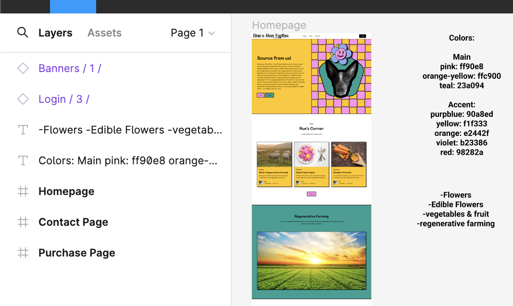

# Atlas-garden_of_dreams

<!-- PROJECT LOGO -->
 

  

<h3 align="center">Garden Of Dreams</h3>

  

    Online Farmers Market for Bulk Purchases
     
    <a href="https://github.com/Frankblation/Atlas-garden_of_dreams"><strong>Explore the docs »</strong></a>
     
     
    <a href="https://github.com/Frankblation/Atlas-garden_of_dreams">View Demo</a>
    ·
    <a href="https://github.com/Frankblation/Atlas-garden_of_dreams/issues/new?labels=bug&template=bug-report---.md">Report Bug</a>
    ·
    <a href="https://github.com/Frankblation/Atlas-garden_of_dreams/issues/new?labels=enhancement&template=feature-request---.md">Request Feature</a>
  

<!-- TABLE OF CONTENTS -->

  
Table of Contents

  <ol>
    <li>
      <a href="#about-the-project">About The Project</a>
      <ul>
        <li><a href="#built-with">Built With</a></li>
      </ul>
    </li>
    <li>
      <a href="#getting-started">Getting Started</a>
      <ul>
        <li><a href="#prerequisites">Prerequisites</a></li>
        <li><a href="#installation">Installation</a></li>
      </ul>
    </li>
    <li><a href="#usage">Usage</a></li>
    <li><a href="#roadmap">Roadmap</a></li>
    <li><a href="#contributing">Contributing</a></li>
    <li><a href="#license">License</a></li>
    <li><a href="#contact">Contact</a></li>
    <li><a href="#acknowledgments">Acknowledgments</a></li>
  </ol>

<!-- ABOUT THE PROJECT -->
## About The Project

Imagine you’ve been tasked with crafting a digital exhibit for the “Garden of Dreams,” a virtual space devoted to exploring the intricate relationship between nature and the human psyche. This project aims to weave together the realms of botanical beauty and deep-seated emotions, presenting an online sanctuary that delves into the heart of our connection with the natural world.

The “Garden of Dreams” has entrusted you with a compilation of dreamlike descriptions, each painting a vivid picture of a unique aspect of this intertwining. You’re invited to select any of these sentences as the foundation for a webpage that captures the essence of the described scene. Your artistic direction is key in deciding how these narratives will unfold visually and emotionally for the visitors.

Here are some example sentences to ignite your creativity:

“A meadow under moonlight, where each blade of grass shimmers with dewdrops of unspoken words.”
“A twilight orchard where trees bear fruits of light, feeding the soul with radiance.”
“A river that flows with the currents of past and future, where water whispers tales of time.”
“A hidden grove where flowers glow with the light of lost stars, guiding wanderers to secrets untold.”
“A canopy of leaves that sing with the colors of emotions, painting the air with the hues of feelings.”
Your mission is to create an engaging and profound online experience that represents the chosen artwork, capturing the delicate balance between the natural and the emotional landscapes, and igniting the visitors’ senses. Through innovative design techniques, such as parallax scrolling, interactive storytelling, dynamic visuals, ai-generated images, or sensory exploration interfaces, your goal is to envelop visitors in a world where nature speaks to the soul.

This is your opportunity to showcase the beauty and depth of the “Garden of Dreams.” Let your design be a portal to a place where imagination and emotion flourish together. Good luck, and let your creativity run wild!

(<a href="#readme-top">back to top</a>)

<!-- GETTING STARTED -->
## Getting Started

Follow this link to get started!

### Prerequisites

Web browser connected to the internet

<!-- USAGE EXAMPLES -->
## Usage

Working links in header and footer that allow user to switch webpages to go to the contact section and shop section and then back to home.

(<a href="#readme-top">back to top</a>)

<!-- CONTRIBUTING -->
## Contributing

Contributions are what make the open source community such an amazing place to learn, inspire, and create. Any contributions you make are **greatly appreciated**.

If you have a suggestion that would make this better, please fork the repo and create a pull request. You can also simply open an issue with the tag "enhancement".
Don't forget to give the project a star! Thanks again!

1. Fork the Project
2. Create your Feature Branch (`git checkout -b feature/AmazingFeature`)
3. Commit your Changes (`git commit -m 'Add some AmazingFeature'`)
4. Push to the Branch (`git push origin feature/AmazingFeature`)
5. Open a Pull Request

(<a href="#readme-top">back to top</a>)

<!-- LICENSE -->
## License

Distributed under the MIT License. See `LICENSE.txt` for more information.

(<a href="#readme-top">back to top</a>)

<!-- CONTACT -->
## Contact

Project Link: [https://github.com/Frankblation/Atlas-garden_of_dreams](https://github.com/Frankblation/Atlas-garden_of_dreams)

(<a href="#readme-top">back to top</a>)

<!-- ACKNOWLEDGMENTS -->
## Acknowledgments

* [Frank Blation](frank@hotmail.com)
* [Matt Krozel](matt@gmail.com)
* [Parker Moore](parker@yahoo.com)

(<a href="#readme-top">back to top</a>)

<!-- MARKDOWN LINKS & IMAGES -->
<!-- https://www.markdownguide.org/basic-syntax/#reference-style-links -->

[product-screenshot]: images/screenshot.png

[Bootstrap.com]: https://img.shields.io/badge/Bootstrap-563D7C?style=for-the-badge&logo=bootstrap&logoColor=white
[Bootstrap-url]: https://getbootstrap.com
[JQuery.com]: https://img.shields.io/badge/jQuery-0769AD?style=for-the-badge&logo=jquery&logoColor=white
[JQuery-url]: https://jquery.com 